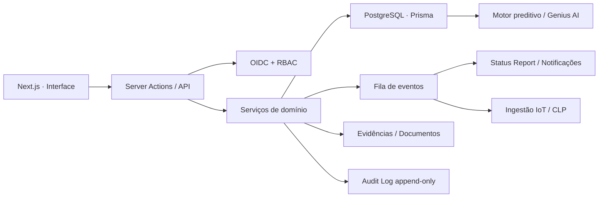

# InventOps Operações — Arquitetura de Fundação

## Objetivo

Centralizar a carteira de projetos industriais e logísticos, transformar execução técnica em informação executiva e criar uma base confiável para previsões de risco, capacidade e gargalos.

## Decisão de arquitetura

- **Frontend e BFF:** Next.js App Router + TypeScript + Tailwind.
- **Banco transacional:** PostgreSQL.
- **ORM e migrações:** Prisma.
- **Validação:** Zod na fronteira de toda Server Action/API e regras de domínio no serviço.
- **Autenticação:** provedor OIDC corporativo; sessão em cookie `HttpOnly`, `Secure` e `SameSite=Lax`.
- **Autorização:** RBAC no middleware para navegação e novamente no servidor para cada operação.
- **Auditoria:** log append-only para alterações de projeto, tarefa, risco, permissão, importação e comunicação.
- **Processamento assíncrono:** fila para importações, relatórios, notificações e telemetria IoT.
- **Arquivos/evidências:** storage de objetos; banco guarda metadados, hash e vínculo.

## Domínios

1. **Identidade e acesso:** usuários, perfis, permissões e sessões.
2. **Portfólio:** projetos, sete fases, 14 departamentos, marcos e dependências.
3. **Execução:** tarefas, responsáveis, prazos, comentários e evidências.
4. **Governança:** RAID, alertas, SLA, cobranças, decisões e auditoria.
5. **Comunicação:** Status Report, e-mail, WhatsApp e histórico de envio.
6. **Capacidade:** disponibilidade, alocação e sobrecarga por área.
7. **Telemetria:** equipamentos, sensores, leituras e incidentes.
8. **Inteligência:** snapshots, cenários, previsões, confiança e recomendações.

## APIs essenciais

- `GET/POST /api/projects`
- `GET/PATCH /api/projects/:id`
- `PATCH /api/projects/:id/status`
- `GET/POST /api/projects/:id/tasks`
- `POST /api/tasks/:id/evidence`
- `GET/POST /api/projects/:id/risks`
- `POST /api/projects/:id/status-report`
- `GET /api/areas/capacity`
- `GET/PATCH /api/alerts/:id`
- `POST /api/imports/projects`
- `POST /api/iot/telemetry`
- `POST /api/scenarios/simulate`

## Regras não negociáveis

- Nenhum percentual global é editado manualmente; ele é derivado de entregáveis ponderados.
- Projeto `CONCLUIDO` sempre retorna progresso `100` e atraso `0`.
- Projeto `BLOQUEADO` exige categoria, dono, próxima ação e data prevista.
- Atualizações críticas rodam em transação e gravam auditoria.
- Importação inválida faz **rollback da transação**; nunca “limpa o banco”.
- Token de tarefa é aleatório, armazenado apenas como hash, expira e é vinculado à tarefa e ao e-mail.
- Middleware melhora a experiência, mas a autorização definitiva sempre ocorre no servidor.

## Escala inicial e evolução

Premissa inicial: até 2 mil projetos, 100 mil tarefas, 10 milhões de eventos de auditoria/telemetria por ano e 500 usuários. PostgreSQL atende com índices, paginação e particionamento futuro para telemetria/auditoria. Separar serviços somente quando volume, equipe ou disponibilidade justificarem; começar como monólito modular reduz custo e risco.

## Trade-offs

- **Monólito modular:** entrega mais rápida e consistência transacional; exige disciplina de fronteiras internas.
- **PostgreSQL:** excelente para governança e relacionamentos; telemetria de alta frequência pode migrar para storage temporal.
- **RBAC:** simples para os quatro perfis iniciais; permissões por projeto/área podem exigir ABAC no futuro.
- **Status Report gerado:** reduz trabalho manual; precisa de revisão humana antes do envio externo.

